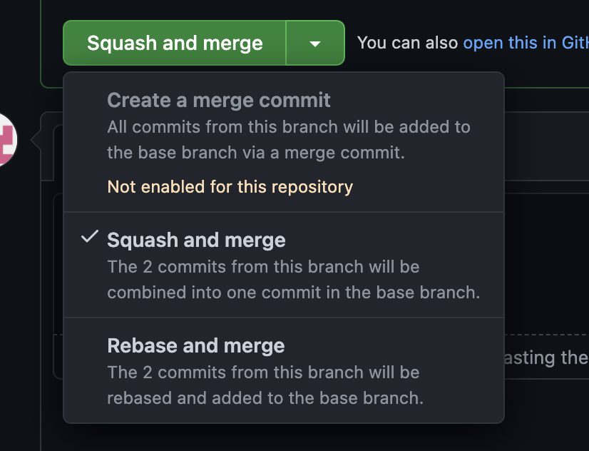

# Отправка PR в мастер

PR с изменениями может попасть в мастер следующими способами:

-   Напрямую в мастер (чаще всего).
-   В релизную ветку с последующим релизом.

Для отправки PR необходимо использовать команды `git rebase` или `git merge --squash` вместо `git merge`.

## Что выбрать: rebase или squash?

-   `rebase`: если коммиты в PR оформлены [по правилам](commits-style.md), описания коммитов понятны и соответствуют сделанной в них работе.
-   `squash`: в ином случае.
