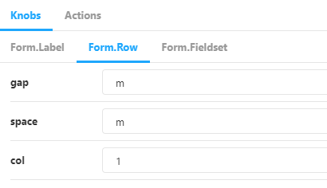

# Правила оформления Storybook

## Оформление stories

При оформлении stories необходимо придерживаться следующих правил:

-   для компонентов обязательно указывать **автора** и **статус**. Примеры приведены ниже, в описании декоратора `withMetadata`
-   именовать knobs так же, как и props компонента
-   приводить в stories все основные сценарии использования
-   именовать stories с маленькой буквы. Стандартное название для stories "по умолчанию"
-   если **компонент**, над которым делается **обертка**, имеет свой Storybook, то достаточно указать на него ссылку. В этом случае не нужно приводить сценарии использования компонента и дублировать knobs
-   перечислить в knobs **свойства**, которые отвечают за **визуальные** изменения в компоненте
-   **группировать** knobs, отделяя основной компонент и подкомпоненты
-   указывать запись `text('%название_компонента(область)% | %свободное описание%', '%значение по умолчанию%')` для knobs, которые служат только для заполнения контентом и не являются **свойствами** этих компонентов
-   не выносить в отдельную группу свойства компонента в knobs, служащих только для заполнения контентом



```jsx
const KNOB_GROUPS = {
  row: 'Form.Row',
  label: 'Form.Label',
  fieldset: 'Form.Fieldset',
};

const rowKnobs = (): React.ComponentProps<typeof Form.Row> => ({
  gap: select('gap', ['m', 'l', 'xl', 'none'], 'm', KNOB_GROUPS.row),
  space: select('space', ['m', 'l', 'xl', 'none'], 'm', KNOB_GROUPS.row),
  col: select('col', ['1', '2', '3', '4'], '1', KNOB_GROUPS.row),
});

const labelKnobs = (): Partial<React.ComponentProps<typeof Form.Label>> => ({
  space: select('space', ['2xs', 'xs', 's', 'none'], 's', KNOB_GROUPS.label),
  size: select('size', ['s', 'l'], 's', KNOB_GROUPS.label),
  htmlFor: text('htmlFor', 'example-1', KNOB_GROUPS.label),
});

const exampleKnobs = (): { text: string } => ({
  text: text('Form.Row | Пример текста', 'Первая ячейка'),
  formFooter: text('футер в форме без иконки | Пример текста', 'Я футер'),
});
```

## Декоратор `withMetadata`

Декоратор добавляет метаинформацию к компоненту в Storybook.
Исходный код: `.storybook/with-metadata/index.tsx`


### Использование

Для добавления метаинформации необходимо воспользоваться методом `addParameters` на уровне story всего компонента и передать объект со свойством `metadata`.

```jsx
storiesOf('ui/Component', module)
  .addParameters({
    metadata: {
      author: 'Дизайн-система ГПН',
      status: 'Approved',
      link: { href: 'https://example.com/docs', 'Документация' },
    },
  })
  .add('Component', () => <Component {...defaultKnobs()} />);
```

Декоратор принимает следующие параметры:

-   status — статус компонента. Возможные значения указаны ниже
-   author — автор компонента
-   description — короткое описание. Сценарии использования указаны ниже
-   link - ссылка. Сценарии использования указаны ниже

Варианты статусов:

-   Approved — компонент закончен и прошел проверку. Готов к использованию
-   Draft — компонент не доработан/не прошел проверку. Может содержать баги
-   Deprecated — компонент устарел и будет удален в следующих мажорных обновлениях. Не рекомендуется к использованию

### Действия декоратора по умолчанию

Если `author` или `status` для компонента не указаны, декоратор заменит отсутствующие значения текстом "не указан" и подсветит его красным цветом.


### Сценарии использования свойства `description`

Основная цель свойства `description` — указать необходимое пояснение к статусу.

Например, с помощью этого свойства можно дополнить статус _Deprecated_ и указать версию пакета, в которой компонент будет полностью удален. Или можно указать новый компонент, который предлагается использовать вместо устаревшего.


```jsx
storiesOf('ui/Component', module)
  .addParameters({
    metadata: {
      author: 'Дизайн-система ГПН',
      status: 'Deprecated',
      description: 'Компонент будет удален в 2.x.x',
    },
  })
  .add('Component', () => <Component {...defaultKnobs()} />);
```

Не используйте свойство для описания особенностей работы компонента. Такое описание лучше вынести в отдельный файл README.

### Сценарии использования свойства `link`

Основная цель свойства `link` — указать ссылку на документацию или Storybook компонента.

Например, если наш компонент является оболочкой над компонентом из дизайн-системы ГПН, то следует указать ссылку на Storybook. В этом случае нет необходимости приводить сценарии использования компонента и полностью дублировать knobs.


```jsx
storiesOf('ui/Component', module)
  .addParameters({
    metadata: {
      author: 'Дизайн-система ГПН',
      status: 'Approved',
      link: {
        href: 'https://gpn-prototypes.github.io/ui-kit/?path=/story/user',
        text: 'Документация',
      },
    },
  })
  .add('Component', () => <Component {...defaultKnobs()} />);
```
