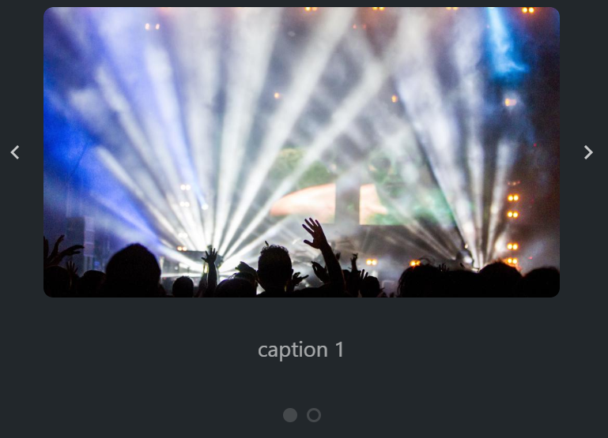

# @gpn-prototypes/vega-carousel

Компонент позволяет пролистывать несколько изображений / другой контент.



### Установка

    yarn add @gpn-prototypes/vega-carousel

### Пример использования

```jsx
import { Carousel } from '@gpn-prototypes/vega-carousel';

export const MyComponent = () => {
  const [idx, setIdx] = React.useState(0);

  return (
    <Carousel currentIdx={idx} onChange={setIdx}>
      <Carousel.Slide caption="caption 1">
        
      </Carousel.Slide>
      <Carousel.Slide caption="caption 2">
        
      </Carousel.Slide>
    </Carousel>
  );
};
```

### API компонента

```ts
interface CarouselProps {
  currentIdx: number; // текущий индекс слайда
  dots?: boolean; // [true] включение/выключение отображения точек навигации
  arrows?: boolean; // [true] включение/выключение отображения стрелок
  autoPlay?: number; // [undefined] интервал между слайдами
  arrowNextLabel?: string; // [Следующий слайд] aria-label для левой стрелки
  arrowPrevLabel?: string; // [Предыдущий слайд] aria-label для правой стрелки
  dotsLabel?: string; // [Навигация по слайдам] aria-label для контейнера с точками навигации
  arrowNextClassName?: string;
  arrowPrevClassName?: string;
  captionClassName?: string;
  trackClassName?: string;
  dotsContainerClassName?: string;
  dotClassName?: string;
  className?: string;
  onChange(idx: number): void; // обработчик события перехода
}

interface CarouselSlideProps {
  caption?: string; // [undefined] текст под слайдом
  className?: string;
}
```
