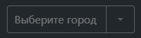

# @gpn-prototypes/vega-combobox

# Combobox

Обёртка для компонента [Combobox](https://consta-uikit.vercel.app/?path=/docs/components-combobox--default-story) из Consta.



### Установка

    yarn add @gpn-prototypes/vega-combobox

### Примеры использования

```jsx
import { Combobox } from '@gpn-prototypes/vega-combobox';

export const MyComponent = () => {
  type Option = {
    label: string;
    value: string;
  };

  const items = [
    { label: 'Москва', value: 'moscow' },
    { label: 'Санкт-Петербург', value: 'spb' },
    { label: 'Томск', value: 'tomsk' },
  ];

  const getItemLabel = (option: Option): string => option.label;

  return (
    <div>
      <Combobox
        id="city"
        placeholder="Выберите город"
        options={items}
        getOptionLabel={getItemLabel}
      />
    </div>
  );
};
```

### API

```ts
type ComboboxProps = {
  title?: string;
  className?: string;
};
```
