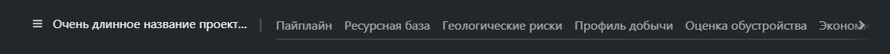

# @gpn-prototypes/vega-header

Компонент Header.



### Установка

```
yarn add @gpn-prototypes/vega-header

```

### Пример использования

```jsx
import { Header } from '@gpn-prototypes/vega-header';

export const MyComponent = () => {
  const navItems = [
    {
      name: 'Пайплайн',
      isActive: true,
    },
    {
      name: 'Ресурсная база',
    },
    {
      name: 'Геологические риски',
    },
  ];
  const menuItems = [
    {
      name: 'Проекты',
      url: '/projects',
      onClick: () => {
        console.log('Проекты');
      },
    },
    { name: 'Обучение', url: '/lessons' },
    { name: 'Помощь', url: '/help' },
  ];

  return (
    <>
      <Header title="Раздел" menuItems={menuItems} navItems={navItems} />
    </>
  );
};
```

### API компонента

```ts
type TabsProps = {
  title: string;
  menuItems: menuItem[];
  navItems: NavItem[];
  onLogout?(): void;
};

type MenuItem = {
  name: string;
  url: string;
  onClick?: (e: MouseEvent | TouchEvent | React.SyntheticEvent) => void;
};

type NavItem = {
  name: string;
  isActive?: boolean;
};
```
