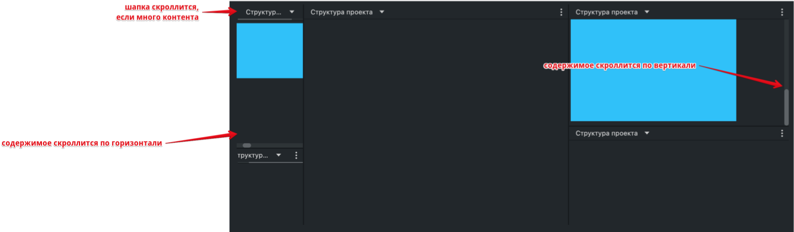

# @gpn-prototypes/vega-layout

Компоненты лэйаута Веги-2.



Позволяют разделять страницу на «окна», которые можно сплиттить (разбивать пополам) и ресайзить (по вертикали и по горизонтали).


#### Layout

- Обертка, внутри которой должны располагаться все компоненты лейаута.

- Внутри одного `Layout` должно быть 1 или 2 `Layout.Window` (не больше).

  Сплиттинг на большее количество окон происходит с помощью разбиения каждого дочерного окна на 2.

  Для сплиттинга `Layout` принимает пропсы размеров (в %) колонок (`columns`) или строк (`rows`).

  Внутри компонента эти пропсы используются для css-свойств `gridTemplateColumns` и `gridTemplateRows`.

- `Layout` передает всем дочерним `Layout.Window` пропс `resize`. Значение пропса он выбирает на основе `columns`/`rows`.

  `<Layout columns={[50, 50]}>` отрендерит `<Layout.Window resize="vertical">`.

  `<Layout rows={[50, 50]}>` отрендерит `<Layout.Window resize="horizontal">`.

  Если в `children` передать что-то помимо `Layout.Window` — пропс `resize` не будет передан.

#### Layout.Window

- Окно, структурный блок лейаута, который можно сплиттить и ресайзить.

- Обязательно должен находиться внутри `Layout`.

- Внутри каждого окна должно быть `Layout.Body` и может быть `Layout.Header`.

- Между каждыми двумя `Layout.Window` есть кнопка-ресайзер, с помощью которой можно изменять размеры окон.

  Компонент `Layout.Window` принимает пропс `resize`, определяющий по какой оси можно окно ресайзить (`vertical` или `horizontal`).

  Самое верхнее окно в иерархии окон — не ресайзится.

#### Layout.Header

Шапка окна, опциональный компонент. Обертка, принимает любой контент.
В шапке располагаются: контрол управления контентом окна и контрол для сплиттинга окна.

#### Layout.Body

Тело окна, где располагается контентная часть. Обертка, принимает любой контент.

### Установка

```
yarn add @gpn-prototypes/vega-layout
```

### Примеры использования

#### Пустой лейаут

```jsx
import { Layout } from '@gpn-prototypes/vega-layout';

export const MyLayout = () => {
  return (
    <Layout>
      <Layout.Window>
        <Layout.Header />
        <Layout.Body />
      </Layout.Window>
    </Layout>
  );
};
```

#### Много окон в лейауте

`Layout > Layout.Window > Layout > Layout.Window*2 > Layout.Header,Layout.Body`

```jsx
import { Layout } from '@gpn-prototypes/vega-layout';

...

<Layout columns={[60, 40]}>

  <Layout.Window>
    <Layout columns={[20, 80]}>

      <Layout.Window>
        <Layout rows={[65, 35]}>

          <Layout.Window>
            <Layout.Header />
            <Layout.Body>
              Текст внутри блока
            </Layout.Body>
          </Layout.Window>

          <Layout.Window>
            <Layout.Header />
          </Layout.Window>

        </Layout>
      </Layout.Window>

      <Layout.Window>
        <Layout.Header />
        <Layout.Body />
      </Layout.Window>

    </Layout>
  </Layout.Window>

  <Layout.Window>
    <Layout rows={[55, 45]}>

      <Layout.Window>
        <Layout.Header />
        <Layout.Body>
          Текст внутри блока
        </Layout.Body>
      </Layout.Window>

      <Layout.Window>
        <Layout.Header />
        <Layout.Body />
      </Layout.Window>

    </Layout>
  </Layout.Window>

</Layout>
```

Больше примером см. в [stories](./src/Layout.stories.tsx)

### API

```ts
type LayoutProps = {
  children?: React.ReactNode;
  className?: string;
  rows?: [number, number]; — размеры строк в %
  columns?: [number, number]; — размеры колонок в %
};
```
