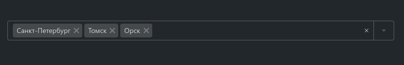

# @gpn-prototypes/vega-multi-combobox



### Установка

    yarn add @gpn-prototypes/vega-multi-combobox

### Примеры использования

```jsx
import { MultiCombobox } from '@gpn-prototypes/vega-multi-combobox';

type Option = {
  label: string;
  value: string;
};

const items = [
  { label: 'Москва', value: 'moscow' },
  { label: 'Санкт-Петербург', value: 'spb' },
  { label: 'Томск', value: 'tomsk' },
];

export const MyComponent = () => {
  const getItemLabel = (option: Option): string => option.label;

  return (
    <MultiCombobox
      id="city"
      value={{ label: 'Москва', value: 'moscow' }}
      options={items}
      getOptionLabel={getItemLabel}
    />
  );
};
```

### API

[Документация](https://consta-uikit.vercel.app/?path=/docs/components-multicombobox--default-story)
