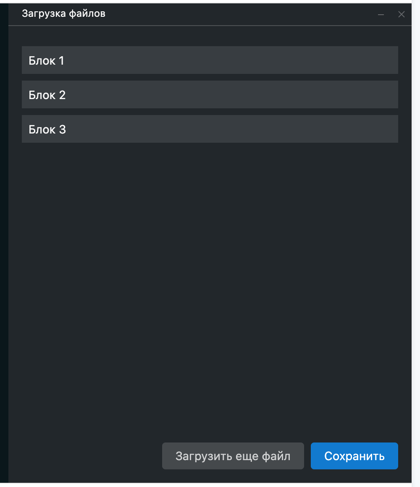
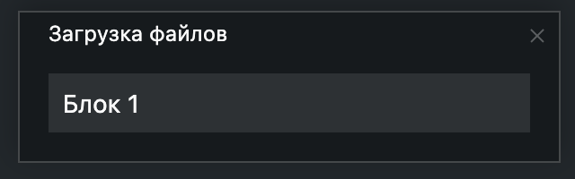

# @gpn-prototypes/vega-sidebar

Компонент "Сайдбар"

#### Сайдбар на всю высоту страницы



#### Свернутый садйбар



### Установка

```
yarn add @gpn-prototypes/vega-sidebar
```

### Примеры использования

```jsx
import { Sidebar, useSidebar } from '@gpn-prototypes/vega-sidebar';

export const MyComponent = () => {
  const {
    state: { isOpen, isMinimized },
    close: handleClose,
    open: handleOpen,
    maximize: handleMaximize,
    minimize: handleMinimize,
  } = useSidebar({
    isOpen: true,
    isMinimized: false,
  });

  return (
    <>
      <Sidebar
        isOpen={isOpen}
        isMinimized={isMinimized}
        onMinimize={handleMinimize}
        onClose={handleClose}
      >
        {isMinimized ? (
          <>
            <Sidebar.Header hasMinimizeButton={false}>// ...</Sidebar.Header>
            <Sidebar.Body>// ...</Sidebar.Body>
          </>
        ) : (
          <>
            <Sidebar.Header>// ...</Sidebar.Header>
            <Sidebar.Body>// ...</Sidebar.Body>
            <Sidebar.Footer>// ...</Sidebar.Footer>
          </>
        )}
      </Sidebar>
    </>
  );
};
```

### API

```ts
type SidebarProps = {
  isOpen?: boolean;
  isMinimized?: boolean;
  align?: 'left' | 'right';
  hasOverlay?: boolean;
  onOverlayClick?: (event: React.MouseEvent<HTMLDivElement, MouseEvent> | KeyboardEvent) => void;
  portalContainerSelector?: string;
  onMinimize?: (event: React.MouseEvent) => void;
  onClose?: (event: React.MouseEvent) => void;
  className?: string;
};
```

```ts
type SidebarHeaderProps = {
  hasMinimizeButton?: boolean;
  className?: string;
};
```

```ts
type SidebarBodyProps = {
  className?: string;
};
```

```ts
type SidebarFooterProps = {
  className?: string;
};
```
