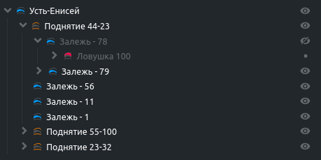

# @gpn-prototypes/vega-tree

Компонент "Дерево"

### Установка

    yarn add @gpn-prototypes/vega-tree

### Примеры использования

#### C иконками, Drag and Drop, контекстным меню и пробросом обработчиков вызова функций контекстного меню



```jsx
import { Tree } from '@gpn-prototypes/vega-tree';

const icons = {
  'blue-line': BlueLineSvg,
  'orange-line': OrangeLineSvg,
  'red-line': RedLineSvg,
};

const nodeList = [
  {
    name: 'Усть-Енисей',
    isDraggable: false,
    iconId: 'blue-line',
    nodeList: [
      {
        name: 'Поднятие 44-23',
        iconId: 'orange-line',
        isDraggable: false,
        nodeList: [
          {
            name: 'Залежь - 78',
            iconId: 'blue-line',
            nodeList: [
              {
                name: 'Ловушка 100',
                iconId: 'red-line',
                nodeList: [
                  {
                    name: 'Еще что-нибудь',
                  },
                ],
              },
            ],
          },
          {
            name: 'Залежь - 79',
            iconId: 'blue-line',
            nodeList: [
              {
                name: 'Ловушка 101',
                iconId: 'red-line',
              },
            ],
          },
          {
            name: 'Залежь - 56',
            iconId: 'blue-line',
          },
          {
            name: 'Залежь - 11',
            iconId: 'blue-line',
          },
          {
            name: 'Залежь - 1',
            iconId: 'blue-line',
          },
        ],
      },
    ],
  },
];

export const MyComponent = () => {
  return <Tree
            icons={icons}
            nodeList={nodeList}
            isContextMenuEnable
            onRenameItem={(id) => console.log(`Запрос к базе на переименование элемента с id ${id}`)}
            onCopyItem={(id) => console.log(`Запрос к базе на копирование элемента с id ${id}`)}
            onDeleteItem={(id) => console.log(`Запрос к базе на удаление элемента с id ${id}`)}
            onPasteItem={(transferringIds, receivingId) => console.log(`Запрос к базе на перемещение элементов с id ${transferringIds}`)}
         />;
};
```

#### C внешними функциональными иконками-компонентами


```jsx
import { Tree } from '@gpn-prototypes/vega-tree';

const icons = {
  'blue-line': BlueLineSvg,
  'orange-line': OrangeLineSvg,
  'red-line': RedLineSvg,
};

const nodeList = [
  {
    name: 'Усть-Енисей',
    isDraggable: false,
    iconId: 'blue-line',
    nodeList: [
      {
        name: 'Поднятие 44-23',
        iconId: 'orange-line',
        isDraggable: false,
        nodeList: [
          {
            name: 'Залежь - 78',
            iconId: 'blue-line',
            nodeList: [
              {
                name: 'Ловушка 100',
                iconId: 'red-line',
                nodeList: [
                  {
                    name: 'Еще что-нибудь',
                  },
                ],
              },
            ],
          },
          {
            name: 'Залежь - 79',
            iconId: 'blue-line',
            nodeList: [
              {
                name: 'Ловушка 101',
                iconId: 'red-line',
              },
            ],
          },
          {
            name: 'Залежь - 56',
            iconId: 'blue-line',
          },
          {
            name: 'Залежь - 11',
            iconId: 'blue-line',
          },
          {
            name: 'Залежь - 1',
            iconId: 'blue-line',
          },
        ],
      },
    ],
  },
];

const ActionItemComponent = () => {
  return (
    <button
      type="button"
      onClick={() => action('action item handler')('Item')}
    >
      <svg
        width="12"
        height="12"
        viewBox="0 0 12 12"
        fill="none"
        xmlns="http://www.w3.org/2000/svg"
      >
        <path
          fillRule="evenodd"
          clipRule="evenodd"
          d="M2 2C2 1.5 2.5 1 3 1H6.13758C6.38606 1 6.51106 1 6.61794 1.044C6.72612 1.08854 6.81575 1.17817 6.99609 1.35851L9.66482 4.0966C9.85962 4.2914 9.95414 4.38592 10 4.5C10.0432 4.60752 10.0432 4.73241 10.0432 4.975L10 10C10 10.5 9.5 11 9 11H3C2.5 11 2 10.5 2 10V2ZM9 4.5L6.5 2V4C6.5 4.27614 6.72386 4.5 7 4.5H8.25H9ZM3.5 6H8V7H3.5V6ZM3.5 9V8H7V9H3.5Z"
          fill="white"
          fillOpacity="0.3"
        />
      </svg>
    </button>
  );
};

export const MyComponent = () => {
  return <Tree
            actionItemComponents={[<ActionItemComponent />]}
            icons={icons}
            nodeList={nodeList}
         />;
};
```

#### Без иконок и Drag and Drop


```jsx
import { Tree } from '@gpn-prototypes/vega-tree';

const nodeList = [
  {
    name: 'Усть-Енисей',
    isDraggable: false,
    nodeList: [
      {
        name: 'Поднятие 44-23',
        isDraggable: false,
        nodeList: [
          {
            name: 'Залежь - 78',
            nodeList: [
              {
                name: 'Ловушка 100',
                nodeList: [
                  {
                    name: 'Еще что-нибудь',
                  },
                ],
              },
            ],
          },
          {
            name: 'Залежь - 79',
            nodeList: [
              {
                name: 'Ловушка 101',
              },
            ],
          },
          {
            name: 'Залежь - 56',
          },
          {
            name: 'Залежь - 11',
          },
          {
            name: 'Залежь - 1',
          },
        ],
      },
    ],
  },
];

export const MyComponent = () => {
  return <Tree
            nodeList={nodeList}
            isDndEnable={false} // Отключит Drag and Drop для всего Дерева
         />;
};
```

### API

```ts
type TreeItem = {
    name: string;
    nodeList: TreeItem[];
    id: string;
    parentId?: string;
    iconId?: string | number; // ID иконки, которая соответствует названию ключа из коллекции ICONS
    isDraggable?: boolean; // Возможность выключить Drag аnd Drop для некоторых элементов
    isDropZone?: boolean // Возможность запретить принимать элементы перемещаемые с помощью Drag and Drop
}

type TreeProps = {
    nodeList: TreeItem[];
    icons?: {
      [iconId: string]: React.ReactElement;
    }; // Коллекция иконок
    actionItemComponents?: React.ReactElement[] // Возможность рендерить кастомные функциональные иконки (пример: иконка, позволяющая скрывать элемент Дерева)
    showIndentGuides?: boolean; // Отвечает за показ линий слева от узлов Дерева. По умолчанию включены.
    withVisibilitySwitcher?: boolean; // Позволяет отключить иконку, скрывающую элемент Дерева. При нажатии меняет стилизацию своего родителя. По умолчанию включено.
    isContextMenuEnable?: boolean; // Возможность добавить контекстное меню. По умолчанию выключено.
    isDndEnable?: boolean; //  Возможность выключить Drag and Drop. По умолчанию включено.
    onRenameItem?: (id) => void; // Функция-обработчик, которая вызывается при попытке переименовать аргумент
    onDuplicateItem?: (id) => void; // Аналогично для дублирования/копирования элемента
    onDeleteItem?: (id) => void; // Аналогично для удаления
    onPasteItem?: (transferringIds: string[], receivingId: string) => void; // Прокинет два аргумента: массив id переносимых элементов; id принимающего. Сработает при вставке и перенесении через DND узла в другой узел. 
};
```
