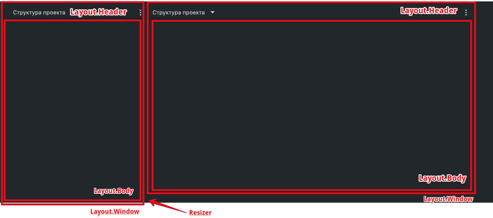

## Компоненты лэйаута


Позволяют разделять страницу на «окна», которые можно сплиттить (разбивать пополам) и ресайзить (по вертикали и по горизонтали).


### Layout

Компонент, который отвечает за создание grid'а, предоставление этого grid'а
и виджетов всем дочерним окнам.

### LayoutView

Компонент, который рекурсивно рендрерит все дерево и использует `LayoutDataView`
или `LayoutSplitView` в зависимости от типа узла дерева.

### LayoutSplitView

Компонент, который группирует два `LayoutView` и обрабатывает логику разделения и ресайза.

### LayoutDataView

Компонент, который обрабатывает выбор виджета и его отображение,
а также обрабатывает логику закрытия и разделения окна на две части.

### LayoutWindow

Окно, структурный блок лейаута, который группирует другие LayoutWindow
либо используется для отображения конкретного виджета.

*   Обязательно должен находиться внутри `Layout`.

*   Контент внутри окна должен быть внутри дочернего компонента `LayoutBody`.

Компонент `LayoutWindow` принимает опциональный проп `split` (для разделенного окна), определяющий ось для ресайза окна (`vertical` или `horizontal`).

### LayoutHeader

Шапка окна — обертка, которая принимает любой контент.
В шапке располагаются контрол управления контентом окна и контрол для сплиттинга окна.

Шапка должна находиться внутри `Layout.Window`, на одном уровне с `Layout.Body`.

### LayoutBody

Тело окна, где располагается контентная часть. Обертка, принимает любой контент.

### LayoutOptions

Компонент рендерит список опций для взаимодействия с Layout.


```ts
type Props = {
  onLayoutChange: (action: 'left' | 'right' | 'top' | 'bottom') => void; // метод, который вызывается по клику на одну из опций
};
```

### LayoutMenu

Компонент, который рендерит список виджетов.


```ts
type Props = {
  activeValue?: string; // текущее активное значение в меню
  items: { value: string; label: string }[]; // массив элементов меню
  onChange: (value: string) => void; // метод, который вызывается по клику на элемент меню
};
```
