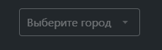

# @gpn-prototypes/vega-select

# Select

Обёртка для компонента [Select](https://consta-uikit.vercel.app/?path=/docs/components-select--playground) из Consta.



### Примеры использования

```jsx
import { Select } from '@gpn-prototypes/vega-ui';

type Item = {
  label: string;
  id: number;
};

const items: Item[] = [
  {
    label: 'Первый',
    id: 1,
  },
  {
    label: 'Второй',
    id: 2,
  },
  {
    label: 'Третий',
    id: 3,
  },
];

export function SelectExampleItems() {
  const [value, setValue] = useState<Item | null>();
  return <Select items={items} value={value} onChange={({ value }) => setValue(value)} />;
}
```

### [API](https://consta-uikit.vercel.app/?path=/docs/components-select--playground)
