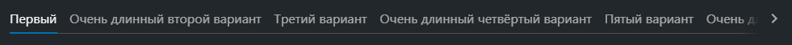

# @gpn-prototypes/vega-tabs

Компонент-обертка для Tabs из UI-kit.


### Пример использования

```jsx
import { IconCamera, IconPhoto, IconRing, Tabs } from '@gpn-prototypes/vega-ui';

export const MyComponent = () => {
  const tabs = [
    {
      name: 'Первый вариант',
      icon: IconPhoto,
    },
    {
      name: 'Второй вариант',
      icon: IconRing,
    },
    {
      name: 'Третий вариант',
      icon: IconCamera,
    },
  ];

  const [value, setValue] = useState(tabs[0]);

  return (
    <>
      <Tabs
        size="s"
        view="bordered"
        withIcon
        items={tabs}
        value={value}
        getLabel={(item) => item.name}
        getIcon={(item) => item.icon}
        onChange={({ value }) => setValue(value)}
      />
    </>
  );
};
```

### API компонента

API компонента полностью совпадает с API компонента [ChoiceGroup](https://ui-kit.gpn.vercel.app/?path=/docs/components-choicegroup--playground) из ui-kit.
